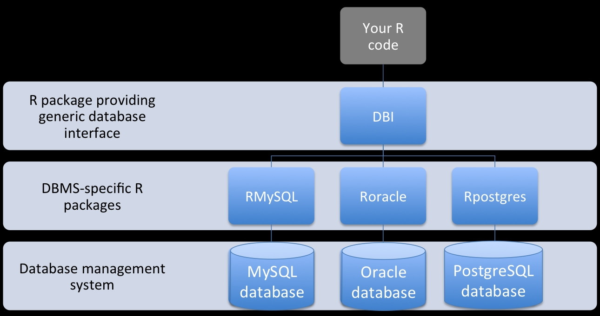

--- 
title: "<br>R语言玩转金融与体彩数据分析"
subtitle: "R语言量化交易"
author: "[(®γσ, ξηg）雷欧，黄联富](https://englianhu.github.io)  ®"
date: "`r Sys.Date()`"
description: 此书乃个人学习R语言的经验分享与建议。
  此文件输出格式为 bookdown::gitbook。
url: 'https\://github.com/englianhu/data-analysis'
github-repo: "englianhu/data-analysis"
cover-image: "images/cover.jpg"
apple-touch-icon: "touch-icon.png"
apple-touch-icon-size: 120
favicon: "favicon.ico"
documentclass: book
link-citations: yes
bibliography:
- book.bib
- packages.bib
site: bookdown::bookdown_site
biblio-style: apalike
---

# 前言 {#preface}

**为何辑写此书**

本书是在下首次辑写参考书（纯属个人经验分享与心得），此前分享了**如何安装®Studio服务器与Shiny服务器**^[[安装 ®StudioとShiny服务器](https://github.com/scibrokes/setup-rstudio-server)]：
  
- [为数据科学家们量身定做の专业统计软件 — ®Studio服务器](https://beta.rstudioconnect.com/englianhu/Introducing-RStudio-Server-for-Data-Scientists/Introducing-RStudio-Server-for-Data-Scientists.html)
- [为数据科学家们量身定做の专业统计软件 — ®Studio服务器（演示文稿）](https://beta.rstudioconnect.com/englianhu/Introducing-RStudio-Server-for-Data-Scientists-Slides/Introducing-RStudio-Server-for-Data-Scientists-slides.html)

在下来自于马来西亚^[个人简历请查阅：[®γσ, ENG LIAN HU](https://beta.rstudioconnect.com/content/3091/ryo-eng.html)]，自2005年入行体彩交易就学习Excel电子表格，而2008年加入**Scicom (MSC) Bhd**后开始接触R语言，并且活跃于[统计之都论坛](https://d.cosx.org)与[经管之家：R语言论坛](http://bbs.pinggu.org/forum-69-1.html)论坛俩与中国大陆同胞交流，并向前辈高手们学习。

前几年，偶然发现了个R语言的使用者界面**®Studio**后，就觉得非常方便，然后自学在[DigitalOcean.com](https://m.do.co/c/aabb124120d0)安装服务器方便随时随地，只要可以上网的地方就可以使用。

前阵子，在下在学习金融交易的时候，无意中发现了本非常实用的经验分享书籍[Successful Algorithmic Trading](https://raw.githubusercontent.com/englianhu/binary.com-interview-question/master/reference/Successful%20Algorithmic%20Trading.pdf)，笔者在金融交易的解说，由入门到精通包括编码分享（笔者介绍了R语言、Python、C++以及比较各优缺点），该笔者**Michael Halls**^[更多该作者详情，请参阅[Struggling To Make Profitable Algo Trading Strategies?](https://www.quantstart.com/successful-algorithmic-trading-ebook)]与在下一样以经验分享著书之见，在下阅读与学习时深深感受到金融交易的武功秘籍（实用教材）如兮，夫复何求哇！

[Coursera Mastering Software Development in R](https://github.com/englianhu/coursera-mastering-software-development-in-r)网络课程提供高级R语言编程教导，倘若有兴趣可以点击该链接报读。

在下才疏学浅，仅有约翰霍金斯大学数据科学专业文凭，倘若有何错误之处，涵清多多包涵并指教。此书乃个人经验之谈。希望在同感身受与共而勉之的情况之下，热衷于金融与体彩行业的学者们可以容易着手。

有关如何辑写`bookdown::gitbook`网络书籍，请参阅[bookdown: Authoring Books and Technical Documents with R Markdown](https://bookdown.org/yihui/bookdown/)。

---

[ Sςιβrοκεrs Trαdιηg®](http://www.scibrokes.com)<br>
<span style='color:RoyalBlue'>**[ 世博量化®](http://www.scibrokes.com)企业知识产权及版权所有，盗版必究。**</span>

```{r include = FALSE}
# automatically create a bib database for R packages
knitr::write_bib(c(
  .packages(), 'bookdown', 'knitr', 'rmarkdown'
), 'packages.bib')
```

# 介绍 {#intro}

  You can label chapter and section titles using `{#label}` after them, e.g., we can reference Chapter \@ref(intro). If you do not manually label them, there will be automatic labels anyway, e.g., Chapter \@ref(analytics).

Figures and tables with captions will be placed in `figure` and `table` environments, respectively.

```{r nice-fig, fig.cap='Here is a nice figure!', out.width='80%', fig.asp=.75, fig.align='center'}
par(mar = c(4, 4, .1, .1))
plot(pressure, type = 'b', pch = 19)
```

Reference a figure by its code chunk label with the `fig:` prefix, e.g., see Figure \@ref(fig:nice-fig). Similarly, you can reference tables generated from `knitr::kable()`, e.g., see Table \@ref(tab:nice-tab).

```{r nice-tab, tidy=FALSE}
knitr::kable(
  head(iris, 20), caption = 'Here is a nice table!',
  booktabs = TRUE
)
```

You can write citations, too. For example, we are using the **bookdown** package [@R-bookdown] in this sample book, which was built on top of R Markdown and **knitr** [@xie2015].

---

## R语言与RStudio

- [[书籍介绍] 史上最强悍R+Python书籍合集](http://bbs.pinggu.org/thread-6507435-1-1.html)
- [`hientm36/gnidart`](https://github.com/hientm36/gnidart)

以下计量经济学相关视频。

- Youtube视频：[Coffee and Econometrics in the Morning](http://novicemetrics.blogspot.com/search/label/video%20tutorials)
- Youtube视频：[IntromediateEcon:Economics, Statistics, R](https://www.youtube.com/channel/UCC-6W7waxcUujJraWPxezfQ)


## Shiny应用

- [How to sample from multidimensional distributions using Gibbs sampling?](https://appsilon.com/how-to-sample-from-multidimensional-distributions-using-gibbs-sampling/)

## 调用其它语言程序

---

[ Sςιβrοκεrs Trαdιηg®](http://www.scibrokes.com)<br>
<span style='color:RoyalBlue'>**[ 世博量化®](http://www.scibrokes.com)企业知识产权及版权所有，盗版必究。**</span>

# 数据分析 {#analytics}

## 读存数据
### 本地文件
### 外来文件

| readr function | Use                                           |
|:--------------:|:---------------------------------------------:|
|read_csv	       | Reads comma-separated file                    |
|read_csv2	     | Reads semicolon-separated file                |
|read_tsv	       | Reads tab-separated file                      |
|read_delim	     | General function for reading delimited files  |
|read_fwf	       | Reads fixed width files                       |
|read_log	       | Reads log files                               |

[在R中读取数据](https://jeevanyue.github.io/post/2018-01-08-read_data_in_r/)

## 采集网络数据
### 普通采集
### API接口
### Web Driver
## 数据处理
### 文字与数字

- [An example of how to use the new R `promises` package](https://appsilon.com/an-example-of-how-to-use-the-new-r-promises-package/)
- [A Future for R: A Comprehensive Overview](https://cran.r-project.org/web/packages/future/vignettes/future-1-overview.html)

| Metacharacter |	Meaning                                 |
|:-------------:|:---------------------------------------:|
| .	            | Any Character                           |
| \w            | A Word                                  |
| \W            | Not a Word                              |
| \d            | A Digit                                 |
| \D            | Not a Digit                             |
| \s            | Whitespace                              |
| \S            | Not Whitespace                          |
| [xyz]         | A Set of Characters                     |
| [^xyz]        | Negation of Set                         |
| [a-z]         | A Range of Characters                   |
| ^	            | Beginning of String                     |
| $	            | End of String                           |
| \n            | Newline                                 |
| +	            | One or More of Previous                 |
| *	            | Zero or More of Previous                |
| ?	            | Zero or One of Previous                 |
| |	            | Either the Previous or the Following    |
| {5}           | Exactly 5 of Previous                   |
| {2, 5}        | Between 2 and 5 or Previous             |
| {2, }         | More than 2 of Previous                 |

```{r, eval=FALSE}
str_extract_all("Mississippi", "(i.{2}){3}")[[1]]
#[1] "ississipp"

str_extract_all("Mississippi", "(i.{2})")[[1]]
#[1] "iss" "iss" "ipp"

str_extract_all("abcdefghijklmnopqrstuvwxyz0123456789", "\\w")[[1]]
# [1] "a" "b" "c" "d" "e" "f" "g" "h" "i" "j" "k" "l" "m" "n" "o" "p" "q" "r"
#[19] "s" "t" "u" "v" "w" "x" "y" "z" "0" "1" "2" "3" "4" "5" "6" "7" "8" "9"

str_extract_all('0123456789', '\\d')[[1]]
# [1] "0" "1" "2" "3" "4" "5" "6" "7" "8" "9"

str_extract_all("\n\t   ", "\\s")[[1]]
#[1] "\n" "\t" " "  " "  " "

str_extract_all("\n\t   ", "\\d")[[1]]
#character(0)

str_extract_all("\n\t   ", "\\w")[[1]]
#character(0)

str_extract_all("abcdefghijklmnopqrstuvwxyz0123456789", "\\d")[[1]]
# [1] "0" "1" "2" "3" "4" "5" "6" "7" "8" "9"

str_extract_all("abcdefghijklmnopqrstuvwxyz0123456789", "\\D")[[1]]
# [1] "a" "b" "c" "d" "e" "f" "g" "h" "i" "j" "k" "l" "m" "n" "o" "p" "q" "r"
#[19] "s" "t" "u" "v" "w" "x" "y" "z"

str_extract_all("rhythms", "[aeiou]")[[1]]
#character(0)

str_extract_all("rhythms", "[^aeiou]")[[1]]
#[1] "r" "h" "y" "t" "h" "m" "s"

grepl("[aeiou]", "rhythms")[[1]]
#[1] FALSE

grepl("[^aeiou]", "rhythms")[[1]]
#[1] TRUE

grepl("a|b", c("abc", "bcd", "cde"))
#[1]  TRUE  TRUE FALSE

grepl("^[ab]+$", c("bab", "aab", "abc"))
#[1]  TRUE  TRUE FALSE

str_extract_all(c("bab", "aab", "abc"), "^[ab]+$")
#[[1]]
#[1] "bab"
#
#[[2]]
#[1] "aab"
#
#[[3]]
#character(0)

str_extract_all(c("bab", "aab", "abc"), "a|b")
#[[1]]
#[1] "b" "a" "b"
#
#[[2]]
#[1] "a" "a" "b"
#
#[[3]]
#[1] "a" "b"

grepl("North|South", c("South Dakota", "North Carolina", "West Virginia"))
#[1]  TRUE  TRUE FALSE

start_end_vowel <- "^[AEIOU]{1}.+[aeiou]{1}$"
vowel_state_lgl <- grepl(start_end_vowel, state.name)
head(vowel_state_lgl)
#[1]  TRUE  TRUE  TRUE FALSE FALSE FALSE

state.name[vowel_state_lgl]
#[1] "Alabama"  "Alaska"   "Arizona"  "Idaho"    "Indiana"  "Iowa"    
#[7] "Ohio"     "Oklahoma"

grepl("[Ii]", c("Hawaii", "Illinois", "Kentucky"))
#[1]  TRUE  TRUE FALSE

str_extract_all(c("Hawaii", "Illinois", "Kentucky"), "[Ii]")
#[[1]]
#[1] "i" "i"
#
#[[2]]
#[1] "I" "i" "i"
#
#[[3]]
#character(0)

str_detect(c("Hawaii", "Illinois", "Kentucky"), "[Ii]")
#[1]  TRUE  TRUE FALSE

## The sub() function takes as arguments a regex, a “replacement,” and a vector of strings. This function will replace the first instance of that regex found in each string.
sub("[Ii]", "1", c("Hawaii", "Illinois", "Kentucky"))
#[1] "Hawa1i"   "1llinois" "Kentucky"

## The gsub() function is nearly the same as sub() except it will replace every instance of the regex that is matched in each string.
gsub("[Ii]", "1", c("Hawaii", "Illinois", "Kentucky"))
#[1] "Hawa11"   "1ll1no1s" "Kentucky"

str_replace_all(c("Hawaii", "Illinois", "Kentucky"), "[Ii]", "1")
#[1] "Hawa11"   "1ll1no1s" "Kentucky"

#The strsplit() function will split up strings according to the provided regex. If strsplit() is provided with a vector of strings it will return a list of string vectors.
two_s <- state.name[grep("ss", state.name)]
two_s
#[1] "Massachusetts" "Mississippi"   "Missouri"      "Tennessee"    

strsplit(two_s, "ss")
#[[1]]
#[1] "Ma"        "achusetts"
#
#[[2]]
#[1] "Mi"   "i"    "ippi"
#
#[[3]]
#[1] "Mi"   "ouri"
#
#[[4]]
#[1] "Tenne" "ee"

library(stringr)

state_tbl <- paste(state.name, state.area, state.abb)
head(state_tbl)
#[1] "Alabama 51609 AL"     "Alaska 589757 AK"     "Arizona 113909 AZ"   
#[4] "Arkansas 53104 AR"    "California 158693 CA" "Colorado 104247 CO"  

str_extract(state_tbl, "[0-9]+")
# [1] "51609"  "589757" "113909" "53104"  "158693" "104247" "5009"  
# [8] "2057"   "58560"  "58876"  "6450"   "83557"  "56400"  "36291" 
#[15] "56290"  "82264"  "40395"  "48523"  "33215"  "10577"  "8257"  
#[22] "58216"  "84068"  "47716"  "69686"  "147138" "77227"  "110540"
#[29] "9304"   "7836"   "121666" "49576"  "52586"  "70665"  "41222" 
#[36] "69919"  "96981"  "45333"  "1214"   "31055"  "77047"  "42244" 
#[43] "267339" "84916"  "9609"   "40815"  "68192"  "24181"  "56154" 
#[50] "97914"

## The str_order() function returns a numeric vector that corresponds to the alphabetical order of the strings in the provided vector.
head(state.abb)
#[1] "AL" "AK" "AZ" "AR" "CA" "CO"

str_order(state.name)
# [1]  1  2  3  4  5  6  7  8  9 10 11 12 13 14 15 16 17 18 19 20 21 22 23 24
#[25] 25 26 27 28 29 30 31 32 33 34 35 36 37 38 39 40 41 42 43 44 45 46 47 48
#[49] 49 50

head(state.name)
#[1] "Alabama"    "Alaska"     "Arizona"    "Arkansas"   "California"
#[6] "Colorado"
str_order(state.abb)
# [1]  2  1  4  3  5  6  7  8  9 10 11 15 12 13 14 16 17 18 21 20 19 22 23 25
#[25] 24 26 33 34 27 29 30 31 28 32 35 36 37 38 39 40 41 42 43 44 46 45 47 49
#[49] 48 50

## The str_pad() function pads strings with other characters which is often useful when the string is going to be eventually printed for a person to read.
str_pad("Thai", width = 8, side = "left", pad = "-")
#[1] "----Thai"

str_pad("Thai", width = 8, side = "right", pad = "-")
#[1] "Thai----"

str_pad("Thai", width = 8, side = "both", pad = "-")
#[1] "--Thai--"

## The str_to_title() function acts just like tolower() andtoupper() except it puts strings into Title Case.
cases <- c("CAPS", "low", "Title")
str_to_title(cases)
#[1] "Caps"  "Low"   "Title"

## The str_trim() function deletes whitespace from both sides of a string.
to_trim <- c("   space", "the    ", "    final frontier  ")
str_trim(to_trim)
#[1] "space"          "the"            "final frontier"

## The str_wrap() function inserts newlines in strings so that when the string is printed each line’s length is limited.
pasted_states <- paste(state.name[1:20], collapse = " ")
cat(str_wrap(pasted_states, width = 80))
#Alabama Alaska Arizona Arkansas California Colorado Connecticut Delaware Florida
#Georgia Hawaii Idaho Illinois Indiana Iowa Kansas Kentucky Louisiana Maine
#Maryland

cat(str_wrap(pasted_states, width = 30))
#Alabama Alaska Arizona
#Arkansas California Colorado
#Connecticut Delaware Florida
#Georgia Hawaii Idaho Illinois
#Indiana Iowa Kansas Kentucky
#Louisiana Maine Maryland

## The word() function allows you to index each word in a string as if it were a vector.
a_tale <- "It was the best of times it was the worst of times it was the age of wisdom it was the age of foolishness"
word(a_tale, 2)
#[1] "was"

word(a_tale, end = 3)
#[1] "It was the"

word(a_tale, start = 11, end = 15)
#[1] "of times it was the"

```

| Metacharacter	 | Meaning                              |
|:--------------:|:------------------------------------:|
| .	             | Any Character                        |
| \w             | A Word                               |
| \W             | Not a Word                           |
| \d             | A Digit                              |
| \D             | Not a Digit                          |
| \s             | Whitespace                           |
| \S             | Not Whitespace                       |
| [xyz]          | A Set of Characters                  |
| [^xyz]         | Negation of Set                      |
| [a-z]	         | A Range of Characters                |
| ^	             | Beginning of String                  |
| $	             | End of String                        |
| \n	           | Newline                              |
| +	             | One or More of Previous              |
| *	             | Zero or More of Previous             |
| ?	             | Zero or One of Previous              |
| |	             | Either the Previous or the Following |
| {5}	           | Exactly 5 of Previous                |
| {2, 5}         | Between 2 and 5 or Previous          |
| {2, }	         | More than 2 of Previous              |

| Operator	| Meaning	                   | Example                                |
|:---------:|:--------------------------:|:--------------------------------------:|
| ==	      | Equals	                   | storm_name == KATRINA                  |
| !=	      | Does not equal	           | min_pressure != 0                      |
| >	        | Greater than	             | latitude > 25                          |
| >=	      | Greater than or equal to	 | max_wind >= 160                        |
| <	        | Less than	                 | min_pressure < 900                     |
| <=	      | Less than or equal to	     | distance_to_land <= 0                  |
| %in%	    | Included in	               | storm_name %in% c("KATRINA", "ANDREW") |
| is.na()	  | Is a missing value         | is.na(radius_34_ne)                    |

> String manipulation in R is useful for data cleaning, plus it can be fun! For prototyping your first regular expressions I highly recommend checking out <http://regexr.com/>. If you’re interested in what some people call a more “humane” way of constructing regular expressions you should check out the [rex](https://github.com/kevinushey/rex) package by [Kevin Ushey](https://github.com/kevinushey) and [Jim Hester](http://www.jimhester.com/). If you’d like to find out more about text analysis I highly recommend reading [Tidy Text Mining in R](http://tidytextmining.com/) by [Julia Silge](http://juliasilge.com/) and [David Robinson](http://varianceexplained.org/).

### 数据框与矩阵

- [`na.locf` using group by from `dplyr`](https://stackoverflow.com/questions/43212308/na-locf-using-group-by-from-dplyr)
- [Replace Missing Values NA with Most Recent Non-NA by Group](https://stackoverflow.com/questions/23340150/replace-missing-values-na-with-most-recent-non-na-by-group)
- [Replace NA with Previous or Next Value by Group using `dplyr`](https://stackoverflow.com/questions/40040834/replace-na-with-previous-or-next-value-by-group-using-dplyr/40041172)
- [NA at the End of Column using `na.locf` Function](https://stackoverflow.com/questions/47242643/na-at-the-end-of-column-using-na-locf-function)
- [`na.locf` Function is Changing `data.frame` Values from `int` to `char` in R](https://stackoverflow.com/questions/49578085/na-locf-function-is-changing-data-frame-values-from-int-to-char-in-r)
- [How to Fill NAs with locf by Factors in `data. frame` split by Country](https://stackoverflow.com/questions/13616965/how-to-fill-nas-with-locf-by-factors-in-data-frame-split-by-country)
- [Replace Missing Values `NA` with Most Recent non-NA by Group](https://stackoverflow.com/questions/23340150/replace-missing-values-na-with-most-recent-non-na-by-group)


### 列表与嵌套数据

```{r, eval=FALSE}
dir.create(file.path('testdir2', 'testdir3'), recursive = TRUE)
```

以上代码可新建一个文件夹和子文件夹。

### 内存

```{r, eval=FALSE}
library(pryr)
mem_used()
#108 MB

sapply(ls(), function(x) object_size(get(x))) %>% sort

mem_change(rm(list = ls()))
#-1.22 kB

## The .Machine object in R (found in the base package) can give you specific details about how your computer/operation system stores different types of data.
str(.Machine) #or tibble::glimpse(.Machince)
#List of 18
# $ double.eps           : num 2.22e-16
# $ double.neg.eps       : num 1.11e-16
# $ double.xmin          : num 2.23e-308
# $ double.xmax          : num 1.8e+308
# $ double.base          : int 2
# $ double.digits        : int 53
# $ double.rounding      : int 5
# $ double.guard         : int 0
# $ double.ulp.digits    : int -52
# $ double.neg.ulp.digits: int -53
# $ double.exponent      : int 11
# $ double.min.exp       : int -1022
# $ double.max.exp       : int 1024
# $ integer.max          : int 2147483647
# $ sizeof.long          : int 8
# $ sizeof.longlong      : int 8
# $ sizeof.longdouble    : int 16
# $ sizeof.pointer       : int 8

## The gc() function in the base package can be used to explicitly trigger a garbage collection in R. Calling gc() explicitly is never actually needed, but it does produce some output that is worth understanding.
gc()
#          used  (Mb) gc trigger  (Mb) max used  (Mb)
#Ncells 3124234 166.9    5938641 317.2  4136665 221.0
#Vcells 6906107  52.7   12255594  93.6 10145775  77.5
```

### 数据库



| Database Management System	| R packages   |
|:---------------------------:|:------------:|
| Oracle	                    | ROracle      |
| MySQL	                      | RMySQL       |
| Microsoft SQL Server	      | RSQLServer   |
| PostgreSQL	                | RPostgres    |
| SQLite	                    | RSQLite      |

> For more on the DBI package, including its history, see [the package’s GitHub README page](https://github.com/rstats-db/DBI).

```{r}

```


## 数据分析程序包

---

[ Sςιβrοκεrs Trαdιηg®](http://www.scibrokes.com)<br>
<span style='color:RoyalBlue'>**[ 世博量化®](http://www.scibrokes.com)企业知识产权及版权所有，盗版必究。**</span>

# 统计模式 {#stats}

## 基本统计学
### 线性模型
### 广义型线性模型
### 最优模型选择
## 高级统计学
### 极大似然估计
### 蒙地卡罗
### 马尔可夫链
### 隐马尔可夫链
### 贝叶斯分析
## 统计学程序包

---

[ Sςιβrοκεrs Trαdιηg®](http://www.scibrokes.com)<br>
<span style='color:RoyalBlue'>**[ 世博量化®](http://www.scibrokes.com)企业知识产权及版权所有，盗版必究。**</span>

# 金融交易 {#finance}

## 金融交易
### 金融交易介绍
### 金融数据

[Chapter 7 Importing Financial Data from the Internet](https://msperlin.github.io/pafdR/importingInternet.html)

### 金融交易统计模型介绍
## 单变量统计模型
### LASSO、ElasticNet、RIDGE模型
### Arima模型

- [Time Series Analysis and Its Applications: With R Examples
*Second Edition*](https://www.stat.pitt.edu/stoffer/tsa2/Rissues.htm)
- [Introduction to Forecasting with ARIMA in R](https://www.datascience.com/blog/introduction-to-forecasting-with-arima-in-r-learn-data-science-tutorials)
- [ARIMA model for forecasting– Example in R](https://rstudio-pubs-static.s3.amazonaws.com/345790_3c1459661736433382863ed19c30ea55.html)

### 指数平滑法
### GARCH模型
## 多变量统计模型 
### GARCH模型
### 
## 高频率交易模型

### Seasonal ARIMA

*Forecasting: Principles and Practice*中的*8.9 Seasonal ARIMA models*章讲述季节性ARIMA模型。

### MIDAS模型
### MIDAS-GARCH
### GARCH模型

- [Copula-DCC-GARCH : rmgarch::cgarchsim() and rmgarch::varxforecast()](https://stackoverflow.com/questions/52391296/copula-dcc-garch-rmgarchcgarchsim-and-rmgarchvarxforecast)

## 其它统计模型
### Levy Process
### Wavelet Tranforms
## 投资管理
### 投资风险管理
### 基金管理
### 多元基金管理
### 基金评估
## 金融交易程序包

---

[ Sςιβrοκεrs Trαdιηg®](http://www.scibrokes.com)<br>
<span style='color:RoyalBlue'>**[ 世博量化®](http://www.scibrokes.com)企业知识产权及版权所有，盗版必究。**</span>

# 体彩交易 {#sportsbook}

## 体彩交易
### 体彩交易介绍
### 体彩数据
### 体彩交易统计模型介绍
## 足球赔率建模
### 单变量泊松模型
### 多变量泊松模型
### Logistic模型
### 
## 足彩投注模型
### 普通投注模型
### 凯利投注模型
### OHLC与GARCH应用
## 投资管理
## 体彩交易程序包

---

[ Sςιβrοκεrs Trαdιηg®](http://www.scibrokes.com)<br>
<span style='color:RoyalBlue'>**[ 世博量化®](http://www.scibrokes.com)企业知识产权及版权所有，盗版必究。**</span>

# 彩票、轮盘、老虎机与宾果 {#lottery}

## 彩票分析与预测
### 数据与统计建模
### 投注模式与回酬
## 轮盘分析与预测
### 数据与统计建模
### 投注模式与回酬
## 老虎机分析与预测

- [An introduction to Monte Carlo Tree Search](https://appsilon.com/an-introduction-to-monte-carlo-tree-search/)

### 数据与统计建模
### 投注模式与回酬
## 宾果分析与预测
### 数据与统计建模
### 投注模式与回酬

---

[ Sςιβrοκεrs Trαdιηg®](http://www.scibrokes.com)<br>
<span style='color:RoyalBlue'>**[ 世博量化®](http://www.scibrokes.com)企业知识产权及版权所有，盗版必究。**</span>

# 高效率编程 {#hft}

## 环境

[Empty R environment becomes large file when saved](https://stackoverflow.com/questions/13912867/empty-r-environment-becomes-large-file-when-saved)

## 高效数据处理

- [Convert a list of data frames into one data frame](https://stackoverflow.com/questions/2851327/convert-a-list-of-data-frames-into-one-data-frame?rq=1)
- [The fastest way to convert numeric to character in R](https://stackoverflow.com/questions/28447014/the-fastest-way-to-convert-numeric-to-character-in-r)
- [The `fst` package](http://www.fstpackage.org/)
- [`splitstackshape`程序包](https://d.cosx.org/d/420148-splitstackshape)
- [Using Sparse Matrices in R](http://www.johnmyleswhite.com/notebook/2011/10/31/using-sparse-matrices-in-r/)
- [Fast data loading from files to R](https://appsilon.com/fast-data-loading-from-files-to-r/)

- [A guide to GPU-accelerated ship recognition in satellite imagery using Keras and R (part I)](https://appsilon.com/a-guide-to-gpu-accelerated-ship-recognition-in-satellite-imagery-using-keras-and-r-part-i/)
- [A guide to GPU-accelerated ships recognition in satellite imagery using Keras and R (part II)](https://appsilon.com/a-guide-to-gpu-accelerated-ships-recognition-in-satellite-imagery-using-keras-and-r-part-ii/)
- [[问答] 对大数据如何用R高效处理](http://bbs.pinggu.org/forum.php?mod=redirect&goto=findpost&ptid=6685427&pid=53936462&fromuid=5794471)和[[问答] 对大数据如何用R高效处理](http://bbs.pinggu.org/forum.php?mod=redirect&goto=findpost&ptid=6685427&pid=53936861&fromuid=5794471)
- [A speed test comparison of plyr, data.table, and dplyr](https://www.r-statistics.com/2013/09/a-speed-test-comparison-of-plyr-data-table-and-dplyr/)
- [Transforming subsets of data in R with by, ddply and data.table](https://magesblog.com/post/2012-06-12-transforming-subsets-of-data-in-r-with/)

```{r, eval=FALSE}
microbenchmark(numeric(1000))
#Unit: microseconds
#          expr   min   lq    mean median    uq   max neval
# numeric(1000) 1.026 1.54 1.95541   1.54 2.053 7.698   100

microbenchmark(rep(0, 1000))
#Unit: microseconds
#         expr   min   lq    mean median    uq    max neval
# rep(0, 1000) 1.026 1.54 2.12477  2.053 2.053 10.777   100

```


## 高效统计建模

- [binary.com 面试试题 I - GARCH模型中的ARIMA(p,d,q)参数最优化](http://rpubs.com/englianhu/binary-Q1FiGJRGARCH)

## 高效率与高级R语言参考书

- [Efficient R programming](https://csgillespie.github.io/efficientR/)
- [Advanced R](http://adv-r.had.co.nz)

---

[ Sςιβrοκεrs Trαdιηg®](http://www.scibrokes.com)<br>
<span style='color:RoyalBlue'>**[ 世博量化®](http://www.scibrokes.com)企业知识产权及版权所有，盗版必究。**</span>

# 基金与投资者管理模型 {#fund}
## 多元化基金管理
### 多元化基金评估

> **Real world application example**
MAB algorithms have multiple practical implementations in the real world, for example, price engine optimization or finding the best online campaign. Let’s focus on the first one and see how we can implement this in R. Imagine you are selling your products online and want to introduce a new one, but are not sure how to price it. You came up with 4 price candidates based on our expert knowledge and experience: 99$, 100$, 115$ and 120$. Now you want to test how those prices will perform and which to choose eventually.
During first day of your experiment 4000 people visited your shop when the first price (99$) was tested and 368 bought the product,
for the rest of the prices we have the following outcome:
- 100$ 4060 visits and 355 purchases,
- 115$ 4011 visits and 373 purchases,
- 120$ 4007 visits and 230 purchases.

*Source : [An introduction to Monte Carlo Tree Search](https://appsilon.com/an-introduction-to-monte-carlo-tree-search/)*

### 
## 投资者管理
### 投资者资金流动统计建模

> **Real world application example**
MAB algorithms have multiple practical implementations in the real world, for example, price engine optimization or finding the best online campaign. Let’s focus on the first one and see how we can implement this in R. Imagine you are selling your products online and want to introduce a new one, but are not sure how to price it. You came up with 4 price candidates based on our expert knowledge and experience: 99$, 100$, 115$ and 120$. Now you want to test how those prices will perform and which to choose eventually.
During first day of your experiment 4000 people visited your shop when the first price (99$) was tested and 368 bought the product,
for the rest of the prices we have the following outcome:
- 100$ 4060 visits and 355 purchases,
- 115$ 4011 visits and 373 purchases,
- 120$ 4007 visits and 230 purchases.

*Source : [An introduction to Monte Carlo Tree Search](https://appsilon.com/an-introduction-to-monte-carlo-tree-search/)*

### 

---

[ Sςιβrοκεrs Trαdιηg®](http://www.scibrokes.com)<br>
<span style='color:RoyalBlue'>**[ 世博量化®](http://www.scibrokes.com)企业知识产权及版权所有，盗版必究。**</span>

# 程序交易 {#algorithm}
## 交易自动化
### 数据连接自动化
### 统计运算自动化
### 基金评估自动化
### 客户管理自动化

- [How we built a Shiny App for 700 users?](https://appsilon.com/how-we-built-a-shiny-app-for-700-users/)

## 多客户管理
### 多投资者
### 绩效管理
## 

`r if (knitr:::is_html_output()) '# 参考文献 {#reference}'`

01. [Calculating the house edge of a slot machine, with R](https://www.r-bloggers.com/calculating-the-house-edge-of-a-slot-machine-with-r/)^[[DON'T DRINK AND GAMBLE:Analyzing and Simulating a Slot Machine - So You Don't Have To](http://giorasimchoni.com/2017/05/06/2017-05-06-don-t-drink-and-gamble/) and [Predicting a Slot Machine's PRNG](https://www.schneier.com/blog/archives/2017/02/predicting_a_sl.html)]
02. [Russians Engineer a Brilliant Slot Machine Cheat-and Casinos Have No Fix](https://www.wired.com/2017/02/russians-engineer-brilliant-slot-machine-cheat-casinos-no-fix/)
03. [Data Science: Theories, Models, Algorithms, and Analytics](https://srdas.github.io/MLBook)
04. [Job Application - Quantitative Analyst](github.com/englianhu/binary.com-interview-question)
05. [Real Time FXCM](https://github.com/scibrokes/real-time-fxcm)
06. [Rmodel](https://github.com/scibrokes/Rmodel)
07. [Odds Modelling and Testing Inefficiency of Sports Bookmakers](https://github.com/scibrokes/odds-modelling-and-testing-inefficiency-of-sports-bookmakers)
08. [Financial Engineering Analytics: A Practice Manual Using R](https://bookdown.org/wfoote01/faur/)
09. [Forecasting: Principles and Practice](https://otexts.org/fpp2/)
10. [Mastering Software Development in R (web-base)](https://bookdown.org/rdpeng/RProgDA/). (or [Mastering Software Development in R.pdf](https://github.com/englianhu/Coursera-Mastering-Software-Development-in-R/blob/master/reference/Mastering%20Software%20Development%20in%20R.pdf))
11. [知乎：量化投资学习推荐的书籍都有哪些？](https://www.zhihu.com/question/54727745)

---

[ Sςιβrοκεrs Trαdιηg®](http://www.scibrokes.com)<br>
<span style='color:RoyalBlue'>**[ 世博量化®](http://www.scibrokes.com)企业知识产权及版权所有，盗版必究。**</span>

<!--chapter:end:index.Rmd-->

